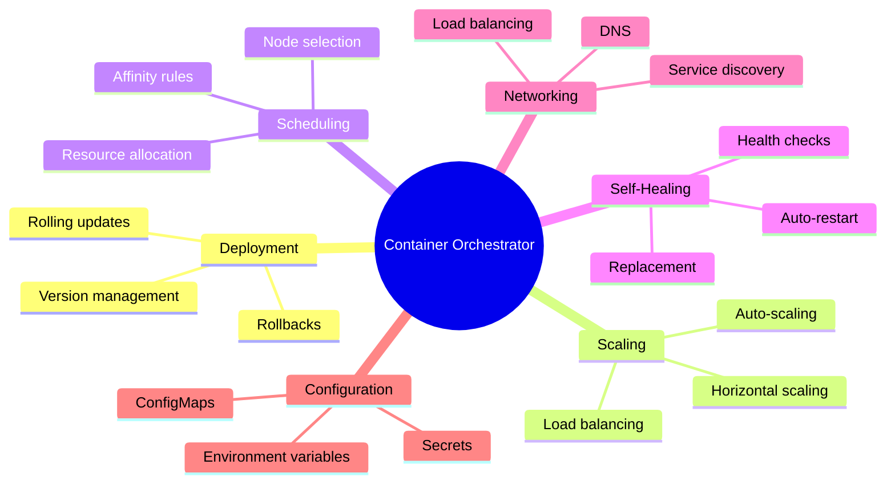
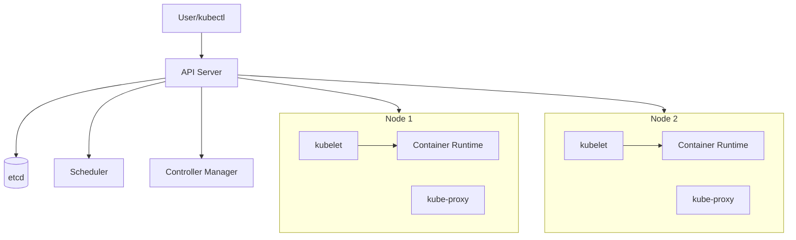

# Orchestration Fundamentals

## A. Why Container Orchestration?

> While Docker makes it easy to run individual containers, managing containers at scale introduces significant challenges that require orchestration.

### Challenges of Running Containers at Scale

| **Challenge** | **Description** |
|--------------|-----------------|
| Deployment | How do you deploy containers across multiple hosts? |
| Scaling | How do you scale up/down based on demand? |
| Networking | How do containers on different hosts communicate? |
| Load Balancing | How is traffic distributed across container instances? |
| Health Monitoring | How do you detect and replace failed containers? |
| Service Discovery | How do services find each other? |
| Configuration | How do you manage configuration across environments? |
| Storage | How do you manage persistent data? |

## B. What is an Orchestrator?

> An **orchestrator** is a system that automates the deployment, management, scaling, and networking of containerized applications.

### Key Functions of an Orchestrator



## C. What is a Scheduler?

> A **scheduler** is a component of the orchestrator that decides which node (server) should run a given container based on available resources and constraints.

### How Kubernetes Scheduling Works

1. User submits a pod specification
2. Scheduler evaluates available nodes
3. Scheduler filters nodes that don't meet requirements
4. Scheduler scores remaining nodes
5. Pod is assigned to the best-scoring node
6. Kubelet on that node starts the container

### Scheduling Considerations

- **Resource Requirements**: CPU, memory requests and limits
- **Node Selectors**: Run pods on specific node types
- **Affinity/Anti-Affinity**: Co-locate or separate pods
- **Taints and Tolerations**: Repel pods from certain nodes
- **Priority**: Higher priority pods can preempt lower ones

## D. Kubernetes Design Principles

### Declarative Configuration

> Instead of telling Kubernetes *how* to do something, you tell it *what* you want. Kubernetes figures out how to achieve that state.

**Imperative (How):**
```bash
# Step by step instructions
kubectl create deployment nginx --image=nginx
kubectl scale deployment nginx --replicas=3
kubectl expose deployment nginx --port=80
```

**Declarative (What):**
```yaml
# Desired end state
apiVersion: apps/v1
kind: Deployment
metadata:
  name: nginx
spec:
  replicas: 3
  selector:
    matchLabels:
      app: nginx
  template:
    metadata:
      labels:
        app: nginx
    spec:
      containers:
      - name: nginx
        image: nginx
        ports:
        - containerPort: 80
```

### Desired State and Reconciliation

> Kubernetes continuously monitors the actual state of the cluster and works to make it match the desired state defined in your configurations.

1. **Desired State**: What you want (defined in YAML manifests)
2. **Actual State**: What currently exists in the cluster
3. **Reconciliation Loop**: Controllers constantly compare and correct drift

### Self-Healing

> Kubernetes automatically replaces failed containers, reschedules pods when nodes die, and kills containers that don't respond to health checks.

## E. Kubernetes Architecture Overview

### Control Plane Components

| **Component** | **Function** |
|--------------|--------------|
| **API Server** | Frontend for the Kubernetes control plane. All communications go through it. |
| **etcd** | Distributed key-value store for all cluster data. Single source of truth. |
| **Scheduler** | Watches for newly created pods and assigns them to nodes. |
| **Controller Manager** | Runs controller processes (Deployment, ReplicaSet, etc.). |

### Node Components

| **Component** | **Function** |
|--------------|--------------|
| **kubelet** | Agent that ensures containers are running in pods on each node. |
| **kube-proxy** | Network proxy that maintains network rules on nodes. |
| **Container Runtime** | Software responsible for running containers (containerd, CRI-O). |

### Component Interaction



## F. Kubernetes Resources and Manifests

> A **manifest** is a YAML (or JSON) file that defines the desired state of a Kubernetes resource.

### Common Resource Types

| **Resource** | **Purpose** |
|-------------|-------------|
| Pod | Smallest deployable unit; one or more containers |
| Deployment | Manages ReplicaSets and rolling updates |
| Service | Network endpoint to access pods |
| ConfigMap | Non-sensitive configuration data |
| Secret | Sensitive data (passwords, tokens) |
| PersistentVolume | Storage resource in the cluster |
| Namespace | Virtual cluster for resource isolation |

### Manifest Structure

Every Kubernetes manifest has these key fields:

```yaml
apiVersion: v1              # API version
kind: Pod                   # Resource type
metadata:                   # Identifiers and labels
  name: my-pod
  labels:
    app: myapp
spec:                       # Desired state specification
  containers:
  - name: mycontainer
    image: nginx
```

## G. How Kubernetes Manages State

### The Control Loop

1. **Observe**: Controllers watch the current state via the API server
2. **Diff**: Compare current state with desired state
3. **Act**: Take action to reconcile any differences

### Example: Deployment Controller

When you create a Deployment with 3 replicas:

1. Deployment controller creates a ReplicaSet
2. ReplicaSet controller creates 3 Pods
3. Scheduler assigns Pods to nodes
4. Kubelet starts containers on assigned nodes

If a Pod fails:
1. ReplicaSet controller observes only 2 running Pods
2. ReplicaSet controller creates a new Pod
3. Scheduler assigns the new Pod to a node
4. Cluster returns to 3 running Pods

## H. Addressing Distributed System Challenges

### Service Discovery

> Kubernetes provides built-in DNS. Services are automatically assigned DNS names.

```bash
# Other pods can reach a service by name
curl http://my-service.my-namespace.svc.cluster.local
# Or simply within the same namespace
curl http://my-service
```

### Load Balancing

> Kubernetes Services automatically load balance traffic across healthy pod instances.

```yaml
apiVersion: v1
kind: Service
metadata:
  name: my-service
spec:
  selector:
    app: myapp    # Routes to all pods with this label
  ports:
  - port: 80
```

### Dynamic Configuration

> ConfigMaps and Secrets allow you to separate configuration from container images.

```yaml
apiVersion: v1
kind: ConfigMap
metadata:
  name: app-config
data:
  database_url: "postgres://db:5432/myapp"
  log_level: "info"
```

## I. Hands-On: Exploring Kubernetes Components

1. View control plane components.
```
kubectl get pods -n kube-system
```

2. Check cluster health.
```
kubectl cluster-info
```

3. View nodes in the cluster.
```
kubectl get nodes
```

4. Describe a node to see its capacity and conditions.
```
kubectl describe node $(kubectl get nodes -o jsonpath='{.items[0].metadata.name}')
```

5. View available API resources.
```
kubectl api-resources
```

6. Check what resources exist in all namespaces.
```
kubectl get all --all-namespaces
```
